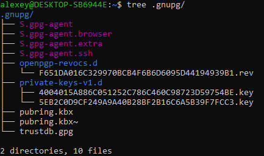
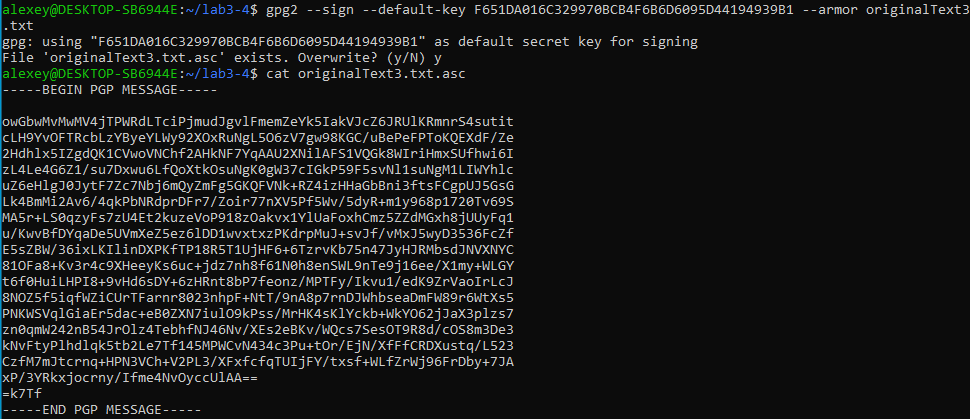
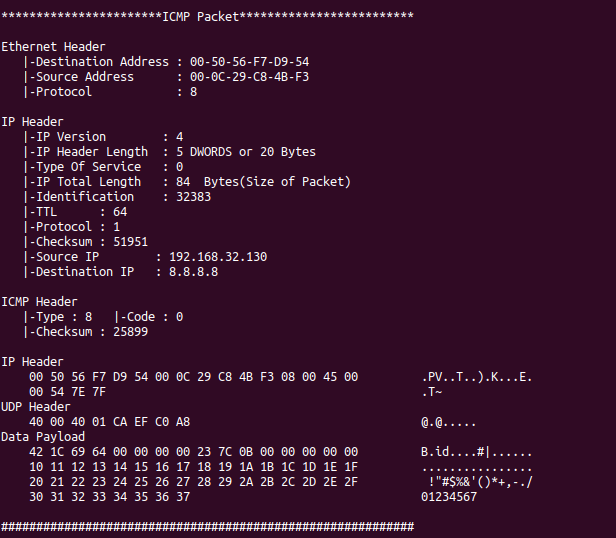
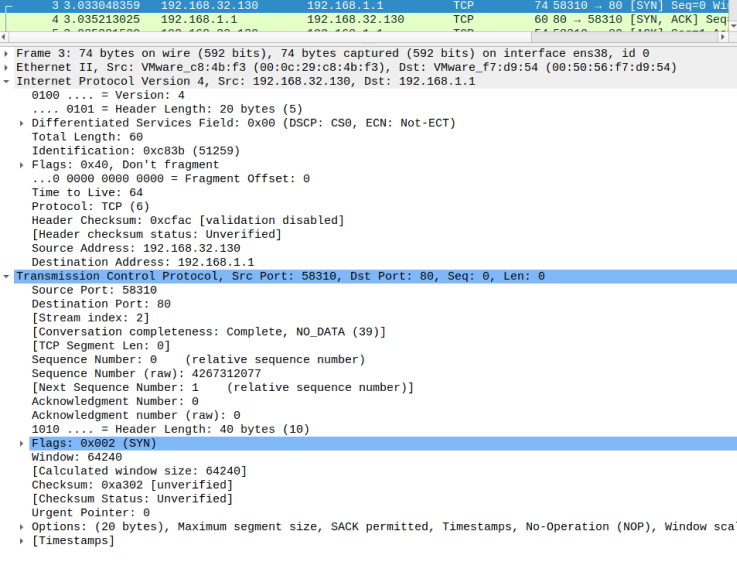
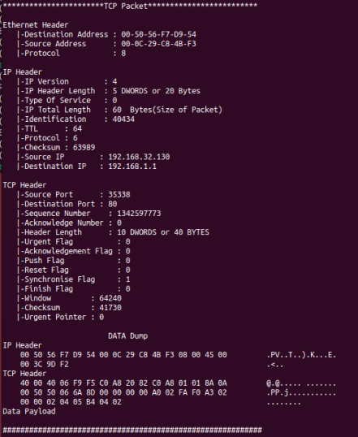
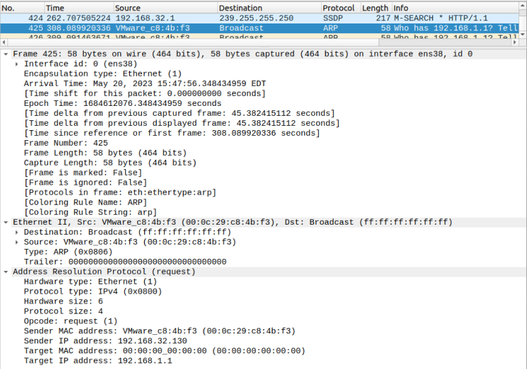

# 1. Network application

**Цель работы:** Освоение набора системных вызовов для создания 
socket-соединений различных типов для обмена данными на хостах и по сети.

*См. отчет по предмету "Операционные системы*

# 2. L4 Socket sample

**Цель работы:** Создание клиент-серверных приложений, взаимодействующих 
друг с другом по сети на основе технологии соединения на сокетах L4.

*См. отчет по предмету "Операционные системы*

# 3. GnuPG tool utilisation 1

## 1. Цель работы 

Установка утилиты GnuPG, исследование ее режимов работы с различными опциями и ключами и выполнение команд из базового списка.

## 2. Ход работы

Данная работа выполнялась на ОС Ubuntu 20.04.6 на WSL (Windows Subsystem for Linux).


## 3. Установка GNU PG2

Установим GNU PG2 (GPG2):


Выведем информацию о текущей версии GPG2:


## 4. Генерация ключей

Сгенерируем ключи для шифрования и подписи (тип 1), размером 4096 и бесконечным временем жизни:


Убедимся в том, что ключ действительно создан и распознан GPG2:


Действительно, сгенерированный ключ появился в списке. Выведем отпечаток ключа - в дальнейшем он потребуется для проверки корректности импорта ключа с сервера:


Проверим структуру папки .gnupg после генерации ключей. Для этого воспользуемся утилитой tree, которая строит файловую структуру заданной папки в удобном визуальном формате:



В полученной структуре можно заметить следующие объекты:

- Каталог, хранящий в себе открытые ключи (opengp-revocs.d);
- Каталог, хранящий в себе приватные ключи (private-keys-v1.d);
- Зашифрованный файл - связку открытых ключей (pubring.kbx);
- Файл с доверительной базой данных (trustdb.gpg).

## 5. Шифрация и дешифрация файла

Создадим документ с произвольным текстом для дальнейшей работы с ним:


Зашифруем созданный файл созданным ранее ключом:


Дешифруем полученный файл тем же ключом, сравним исходный и полученный файлы:


Различий между исходным файлом и результирующим файлом нет, что свидетельствует об успешном процессе шифрации и дешифрации.

## 6. Создание цифровой подписи

Создадим новый файл, сгенерируем к нему цифровую подпись:


Проверим полученную цифровую подпись:


Полученный результат "Good signature" свидетельствует о том, что подписанному документу был найден соответствующий ключ из хранилища.

## 7. Исследование прочих команд GPG2

При помощи GPG2 возможна и более тонкая настройка ключа при его создании при добавлении флага **--expert**. Попробуем создать ещё один ключ подобным образом:


Очевидно, что помимо добавления и создания ключей доступна операция их удаления из хранилища. Попроуем удалить созданные нами ключи в правильном порядке: сначала приватные, затем связанные с ними публичные:


## 8. Выводы

В рамках данной работы были изучены основы работы с GPG: создание и удаления пар ключей (публичный/приватный), шифрация и дешифрация файлов при помощи ключей, создание электронной подписи файла и её проверка.

# 4. GnuPG tool utilisation 2

## 1. Цель работы

Импорт и экспорт ключей (цифровых подписей), шифрование сообщений с помощью цифровых подписей.

## 2. Ход работы

Данная работа выполнялась на ОС Ubuntu 20.04.6 на WSL (Windows Subsystem for Linux).


## 3. Создание и использование электронной цифровой подписи (ЭЦП)

Шифрация файлов и проверка подписей может осуществляться при помощи открытого ключа. Для дальнейшей работы используется ключ, созданный в предыдущей лабораторной работе:


Экспортируем данный ключ в внешний файл:


Создадим новый файл для дальнейшей работы с ним:


Создадим для него отсоединённую ЭЦП в текстовом формате:


Аналогичным образом, создадим отсоединённую ЭЦП в бинарном формате:


После выполнения команды произошло создание файла ЭЦП originalText3.txt.sig, который и является отсоединённой ЭЦП.

Создадим встроенную в файл ЭЦП в текстовом формате:



Аналогичным образом, создадим встроенную ЭЦП в бинарном формате:


После выполнения команды произошло создание файла originalText3.txt.gpg.

## 4. Импорт и экспорт ключей

Предварительно отчистив хранилище ключей, импортируем созданный ранее ключ и убедимся в корректности его импорта:


Отредактируем импортированный ключ - установим к нему доверие, что потребуется для дальнейшей проверки ЭЦП:


Теперь, при наличии импортированного доверенного ключа, проверим отсоединённую ЭЦП из предыдущего пункта:


Полученный результат - Good signature - свидетельствует о том, что ключ соответствует использованному при генерации ЭЦП.

Экспортируем этот же ключ на внешний сервер keyserver.ubuntu.com, убедимся в том, что ключ действительно находится на сервере:


Первая полученная ошибка может быть объяснена тем, что сервер не успел так быстро обработать полученный ключ - поэтому первый запрос ключа закончился получением ошибки, а второй прошёл успешно.

Импортируем экспортированный ранее ключ:


Полученный с сервера ключ соответствует имеющемся, о чём говорит строка unchanged: 1 в результате.

## 5. Выводы

В рамках данной работы были изучены основные способы генерации встроенных и отсоединённых ЭЦП при помощи GPG2. Также был получен практический опыт по импорту и экспорту ключей как в отдельный файл, так и на внешний сервер.


# 5. WireShark packet sniffing

**Цель работы:** Установка и исследование возможностей анализатора 
сетевого трафика Wireshark.

*TODO*

# 6. Nmap network scanning

**Цель работы:** Исследование утилиты Nmap для сканирования сегмента сети.

*TODO*

# 7. Netcat and Cryptcat utilities

## 1. Цель работы

Исследование взаимодействия процессов на разных хостах с использованием утилит Netcat и её защищенного аналога Cryptcat.

## 2. Ход работы

Устройства, за которыми производилось исследование утилит, подключены с помощью Wi-Fi роутера к домашней сети. В таблице ниже преведены некоторые параметры устройств в этой сети.

| Тип               | IP адрес       |
| ----------------- | -------------- |
| Хост с OC Linux   | 192.168.31.239 |
| Хост с ОС Windows | 192.168.31.26  |

## 3. Утилита Netcat

**Netcat** — это сетевой инструмент для чтения и записи данных через сетевые подключения с использованием TCP или UDP.

### 3.1. Netcat чат

Организуем простой чат с использованием утилиты Netcat. Для этого запустим на двух  хостах два экземпляра Netcat, один из которых будет находиться в состоянии слушателя, а второй инициировать подключение с первым. Подключение будет производиться по порту 31337.

**Флаги:**

- `-l` — прослушивать входящие соединения, а не инициировать подключение к удаленному хосту.

- `-p port` — устанаваливает порт прослушивания (в нашем случае 31337).


В результате на хосте с ОС Windows был запущен слушатель, к которому в последствии подключился хост с ОС Linux. На изображениях выше также продемонстрирован обмен сообщениями между двумя хостами.

### 3.2. Netcat передача файлов

Организуем передачу файлов с использованием утилиты Netcat. Попробуем передать текстовый файл с одного хоста на другой. Содержимое файла представлено на рисунке ниже.


Для передачи файла запустим утилиту Netcat в режиме слушателя по порту 31337 на одном хосте и зададим передаваемый файл, после чего инициируем соединение с другого хоста для получения передаваемого файла. 

**Флаги:**

- `-v` — подробный режим отображения логов.

- `-l` — прослушивать входящие соединения, а не инициировать подключение к удаленному хосту.

- `-w timeout` — автоматически закрыть соединение, если соединение и stdin простаивают более *timeout* секунд.

- `-n` — не выполнять поиск имен через DNS


При попытке инициирования подключения у клиента появляется сообщение о том, что данный порт отркты для этого ip адреса. На стороне слушателя появилось сообщение о подключении клиента (по ip адресу видно, что подключился наш хост с ОС Linux). Спустя 30 секунд бездействия произошло автоматическое закрытие соединения. В результате файл был успешно передан.

## 4. Утилита Cryptcat

**Cryptcat**— это стандартный netcat, дополненный шифрованием twofish (симметричный алгоритм блочного шифрования с размером блока 128 бит и длиной ключа до 256 бит).

Попробуем организовать чат с использованием утилиты cryptcat, а также проанализируем трафик с помощью сетевого снифера Wireshark в случае защищенного и открытого соединений.

Принцип организации соединения остался таким же. Единственным отличием является наличие симметричного ключа.

**Флаги:**

- `-k keyword` — назначение симметричного ключа.


Воспользуемся сетевым снифером Wireshark и сравним трафик в случае защищенного/открытого соединения. В результате видим, что пакеты переданные с помощью утилиты netcat в заголовке data содержат сообщения в открытом виде, что показано на рисунке ниже.


Cryptcat в свою очередь шифрует всю передаваемую информацию. На рисунке ниже показан пример зашифрованных данных в заголовке data.


## 5. Вывод

В данной работе мы познакомились с возможностями утилиты netcat и её безопасной версии cryptcat.

# 8. Firewalls, iptables rules

## 1. Цель работы

Исследование контроля и фильтрации проходящего сетевого трафика в соответствии с заданными правилами с использованием утилиты iptables.

## 2. Ход работы

**iptables** — утилита командной строки, является стандартным интерфейсом управления работой межсетевого экрана netfilter для ядер Linux. Iptables оперирует некими правилами (rules), на основании которых решается судьба пакета, который поступил на интерфейс сетевого устройства.

### 2.1. Получение списка правил

Посмотреть текущие правила, установленные в iptables, можно при помощи команды:
`sudo iptables -L`.
Результат её работы представлен на рисунке ниже.


### 2.2. Блокировка всего входящего трафика

Заблокируем весь входящий трафик. Для этого воспользуемся командой: 
`sudo iptables -A INPUT -j DROP`

**Флаги:**

+ `-A chain rule-specificationУ `— добавить одно или несколько правил в конец выбранной цепочки.

+ `-j target `— определить цель правила (что делать, если пакет соответствует правилу)

На рисунке ниже представлено сосояние списка после добавления нового правила.


Вызова утилиты ping и использование браузера не дали результата. Число заблокированных пакетов можно увидеть на рисунке ниже.


### 2.3. Фильтрация входящего трафика

Попробуем отфильтровать весь трафик так, чтобы проходил только веб-трафик. Для этого:

1. Установим **DROP** в качестве политики по умолчанию

    `sudo iptables -P INPUT DROP`

2. Разрешим трафик для loopback, чтобы внутренние сервисы нормально работали

    `sudo iptables -A INPUT -i lo -j ACCEPT`

3. Теперь разрешим TCP и UDP соединения, которые сами создаем:

    `sudo iptables -A INPUT -p tcp -m state --state ESTABLISHED,RELATED -j ACCEPT`

    `sudo iptables -A INPUT -p udp -m state --state ESTABLISHED,RELATED -j ACCEPT`

4. Разрешим работу DNS-сервиса

    `sudo iptables -A INPUT -p tcp --dport 53 -j ACCEPT`

    `sudo iptables -A INPUT -p tcp --sport 53 -j ACCEPT`

    `sudo iptables -A INPUT -p udp --dport 53 -j ACCEPT`

    `sudo iptables -A INPUT -p udp --sport 53 -j ACCEPT`

5. Разрешим http и https

    `sudo iptables -A INPUT -p tcp --dport 80 -j ACCEPT`

    `sudo iptables -A INPUT -p tcp --dport 443 -j ACCEPT`

**Флаги:**

+ `-A chain rule-specification` — добавить одно или несколько правил в конец выбранной цепочки.

+ `-P chain target `— устанавливает политику для цепочки на заданную цель

+ `-i name` — определяет имя интерфейса, через который был получен пакет

+ `-j target` — определить цель правила (что делать, если пакет соответствует правилу)

+ `-p protocol` — определяет протокол правила или пакета для проверки

+ `--state state` — определяет состояния соединения, которым нужно соответствовать
  
  + **ESTABLISHED** — пакет связан с соединением, которое просматривало пакеты в обоих направлениях
  
  + **RELATED** — пакет запускает новое соединение, но связан с существующим соединением

+ `--dport [ports]` — порт назначения является одним из заданных портов

+ `--sport [ports]` — порт источника является одним из заданных портов

Итоговая таблица правил представлена на рисунке ниже


Проверим работу нашего фильтра. Для эмуляции работы WEB-сервера используем Netcat.


В результате видим, что передача произошла без потерь.

## 3. Вывод

В  ходе выполнения данной работы нами были изученые основные возможности управления цепочками правил при помощи утилиты iptables.

По итогам работы нами был разработан сервер защищённый от внешних подключений.

# 9. Iptables implementation

**Цель работы:** Установка правил фильтрации исходящего трафика при помощи утилиты iptables.

*TODO*

# 10. Connections Limit

**Цель работы:** Ограничение количества ssh-соединений.

*TODO*

# 11. L2, L3 Sockets sniffing

## 1. Цель работы

Исследование возможности RAW-сокетов предоставляющих доступ к полям заголовков сообщений протоколов уровней L2 и L3 модели OSI.

## 2. Ход работы

Работа выполнялась на Ubuntu 20.04.6, запущенной на виртуальной машине и имеющей IP 192.168.30.130.

## 3. Создание сниффера пакетов


Глобально логику работы сниффера можно поделить на несколько этапов:

- Поиск и выбор интерфейса для перехвата пакетов;
- Определение типа поступившего пакета;
- Вывод информации о пакете в лог-файл.

### 3.1. Поиск и выбор интерфейса для перехвата пакетов

Приведённый далее код позволяет пользователю получить список всех доступных интерфейсов, выбрать нужное и перехватывать все пакеты, которые поступают на данный интерфейс.

```cpp
        //First get the list of available devices
	printf("Finding available devices ... ");
	if( pcap_findalldevs( &alldevsp , errbuf) )
	{
		printf("Error finding devices : %s" , errbuf);
		exit(1);
	}
	printf("Done");
	
	//Print the available devices
	printf("\nAvailable Devices are :\n");
	for(device = alldevsp ; device != NULL ; device = device->next)
	{
		printf("%d. %s - %s\n" , count , device->name , device->description);
		if(device->name != NULL)
		{
			strcpy(devs[count] , device->name);
		}
		count++;
	}
	
	//Ask user which device to sniff
	printf("Enter the number of the device you want to sniff : ");
	scanf("%d" , &n);
	devname = devs[n];
	
	//Open the device for sniffing
	printf("Opening device %s for sniffing ... " , devname);
	handle = pcap_open_live(devname , 65536 , 1 , 0 , errbuf);
```

```cpp
	pcap_loop(handle , -1 , process_packet , NULL);
```

Стоит отметить, что получениче доступа ко всем интерфейсам - операция, требующая root-прав, и именно поэтому сам сниффер необходимо будет запускать с использованием sudo.

### 3.2 Определение типа поступившего пакета

Приведённый далее код использует данные из заголовков пакетов для определения типа пакета и вызова соответствующей функции. Большая их часть (ICMP, TCP, UDP) функционируют поверх IP, и для них информацию о типе пакета можно получить из IP-заголовка.

```cpp
 	//Get the IP Header part of this packet , excluding the ethernet header
	struct ethhdr *eth = (struct ethhdr *)buffer;
	struct arphdr *arp;
	arp = (struct arphdr *) (buffer + sizeof(struct ethhdr));
	print_arp_packet(arp);
	
	
	struct iphdr *iph = (struct iphdr*)(buffer + sizeof(struct ethhdr));
	++total;
	switch (iph->protocol) //Check the Protocol and do accordingly...
	{
		case 1:  //ICMP Protocol
			++icmp;
			print_icmp_packet( buffer , size);
			break;
		
		case 2:  //IGMP Protocol
			++igmp;
			break;
		
		case 6:  //TCP Protocol
			++tcp;
			print_tcp_packet(buffer , size);
			break;
		
		case 17: //UDP Protocol
			++udp;
			print_udp_packet(buffer , size);
			break;
```

### 3.3. Вывод информации из заголовка

При помощи структур (struct) можно достаточно легко и просто "форматировать" выделенный заголовку фрагент памяти. В качестве примера приведём обработку TCP-заголовка:

```cpp
void print_tcp_packet(const u_char * Buffer, int Size)
{
	unsigned short iphdrlen;
	
	struct iphdr *iph = (struct iphdr *)( Buffer  + sizeof(struct ethhdr) );
	iphdrlen = iph->ihl*4;
	
	struct tcphdr *tcph=(struct tcphdr*)(Buffer + iphdrlen + sizeof(struct ethhdr));
			
	int header_size =  sizeof(struct ethhdr) + iphdrlen + tcph->doff*4;
	
	fprintf(logfile , "\n\n***********************TCP Packet*************************\n");	
		
	print_ip_header(Buffer,Size);
		
	fprintf(logfile , "\n");
	fprintf(logfile , "TCP Header\n");
	fprintf(logfile , "   |-Source Port      : %u\n",ntohs(tcph->source));
	fprintf(logfile , "   |-Destination Port : %u\n",ntohs(tcph->dest));
	fprintf(logfile , "   |-Sequence Number    : %u\n",ntohl(tcph->seq));
	fprintf(logfile , "   |-Acknowledge Number : %u\n",ntohl(tcph->ack_seq));
	fprintf(logfile , "   |-Header Length      : %d DWORDS or %d BYTES\n" ,(unsigned int)tcph->doff,(unsigned int)tcph->doff*4);
	//fprintf(logfile , "   |-CWR Flag : %d\n",(unsigned int)tcph->cwr);
	//fprintf(logfile , "   |-ECN Flag : %d\n",(unsigned int)tcph->ece);
	fprintf(logfile , "   |-Urgent Flag          : %d\n",(unsigned int)tcph->urg);
	fprintf(logfile , "   |-Acknowledgement Flag : %d\n",(unsigned int)tcph->ack);
	fprintf(logfile , "   |-Push Flag            : %d\n",(unsigned int)tcph->psh);
	fprintf(logfile , "   |-Reset Flag           : %d\n",(unsigned int)tcph->rst);
	fprintf(logfile , "   |-Synchronise Flag     : %d\n",(unsigned int)tcph->syn);
	fprintf(logfile , "   |-Finish Flag          : %d\n",(unsigned int)tcph->fin);
	fprintf(logfile , "   |-Window         : %d\n",ntohs(tcph->window));
	fprintf(logfile , "   |-Checksum       : %d\n",ntohs(tcph->check));
	fprintf(logfile , "   |-Urgent Pointer : %d\n",tcph->urg_ptr);
	fprintf(logfile , "\n");
	fprintf(logfile , "                        DATA Dump                         ");
	fprintf(logfile , "\n");
		
	fprintf(logfile , "IP Header\n");
	PrintData(Buffer,iphdrlen);
		
	fprintf(logfile , "TCP Header\n");
	PrintData(Buffer+iphdrlen,tcph->doff*4);
		
	fprintf(logfile , "Data Payload\n");	
	PrintData(Buffer + header_size , Size - header_size );
						
	fprintf(logfile , "\n###########################################################");
}
```

Самое интересное в приведённом выше коде - это создание структуры с заданным начальным адресом (сдвиг относительно начала всего буфера на размеры Ethernet- и IP-заголовков) и последующие достаточно простые операции обращения к необходимым значениям, например, **ntohs(tcph->source)**.

## 4. Тестирование сниффера

Тестирование сниффера производилось в паре с Wireshark - популярным и стабильынм сниффером трафика.

### 4.1. Протокол ICMP

Выполним команду **ping 8.8.8.8**, проверим, какую информацию получится получить из перехваченных ICMP-пакетов:




### 4.2. Протокол TCP

Выполним команду для сканирования TCP-портов **sudo nmap -PS 192.168.1.1 -p 80**, проверим информацию, полученную из перехваченных пакетов:





### 4.3. Протокол UDP

Аналогично предыдущему пункту, выполним команду для сканирования TCP-портов **sudo nmap -sU 192.168.1.1 -p 80**, проверим информацию, полученную из перехваченных пакетов:


### 4.4. Протокол ARP

sudo arping 192.168.1.1

Для получения информации из ARP-пакетов воспользуемся командой **arping 192.168.1.1**, сравним полученную из пакетов информацию:




### 4.5. Результаты тестирования

Полученная при помощи сниффера информация соответствует эталонной, полученной из Wireshark, и не противоречит здравому смыслу. Стоит отметить, что в сравнении с созданным сниффером Wireshark является куда более продвинутым и удобным в использовании вследствие большого количества сил и времени, затраченного на его разработку.

## 5. Выводы

В рамках данной работы был написан сниффер пакетов для протоколов ICMP, TCP, UDP и ARP. Работа сниффера была протестирована, результаты соответствуют аналогичным в Wireshark, что говорит о корректности созданной нами программы.

# Приложение 1.

Полный код sniffer.c

```cpp
/*
	Packet sniffer using libpcap library
*/
#include<pcap.h>
#include<stdio.h>
#include<stdlib.h> // for exit()
#include<string.h> //for memset

#include<sys/socket.h>
#include<arpa/inet.h> // for inet_ntoa()
#include<net/ethernet.h>
#include<netinet/ip_icmp.h>	//Provides declarations for icmp header
#include<netinet/udp.h>	//Provides declarations for udp header
#include<netinet/tcp.h>	//Provides declarations for tcp header
#include<netinet/ip.h>	//Provides declarations for ip header


#define ETH_P_ARP 0x0806
#define ARP_REQUEST 1
#define ARP_REPLY 2

typedef struct arphdr {
	u_int16_t htype;
        u_int16_t ptype;
	u_char hlen;
	u_char plen;
        u_int16_t oper;
	u_char sha[6];
	u_char spa[4];
	u_char tha[6];
	u_char tpa[4];

}arphdr_t;

void process_packet(u_char *, const struct pcap_pkthdr *, const u_char *);
void process_ip_packet(const u_char * , int);
void print_ip_packet(const u_char * , int);
void print_tcp_packet(const u_char *  , int );
void print_udp_packet(const u_char * , int);
void print_icmp_packet(const u_char * , int );
void print_arp_packet(arphdr_t *arpheader);
void PrintData (const u_char * , int);

FILE *logfile;
struct sockaddr_in source,dest;
int tcp=0,udp=0,icmp=0,others=0,igmp=0,arp=0,total=0,i,j;	

int main()
{
	pcap_if_t *alldevsp , *device;
	pcap_t *handle; //Handle of the device that shall be sniffed

	char errbuf[100] , *devname , devs[100][100];
	int count = 1 , n;
	
	//First get the list of available devices
	printf("Finding available devices ... ");
	if( pcap_findalldevs( &alldevsp , errbuf) )
	{
		printf("Error finding devices : %s" , errbuf);
		exit(1);
	}
	printf("Done");
	
	//Print the available devices
	printf("\nAvailable Devices are :\n");
	for(device = alldevsp ; device != NULL ; device = device->next)
	{
		printf("%d. %s - %s\n" , count , device->name , device->description);
		if(device->name != NULL)
		{
			strcpy(devs[count] , device->name);
		}
		count++;
	}
	
	//Ask user which device to sniff
	printf("Enter the number of the device you want to sniff : ");
	scanf("%d" , &n);
	devname = devs[n];
	
	//Open the device for sniffing
	printf("Opening device %s for sniffing ... " , devname);
	handle = pcap_open_live(devname , 65536 , 1 , 0 , errbuf);
	
	if (handle == NULL) 
	{
		fprintf(stderr, "Couldn't open device %s : %s\n" , devname , errbuf);
		exit(1);
	}
	printf("Done\n");
	
	logfile=fopen("log.txt","w");
	if(logfile==NULL) 
	{
		printf("Unable to create file.");
	}
	
	//Put the device in sniff loop
	pcap_loop(handle , -1 , process_packet , NULL);
	
	return 0;	
}

void process_packet(u_char *args, const struct pcap_pkthdr *header, const u_char *buffer)
{
	int size = header->len;
	
	//Get the IP Header part of this packet , excluding the ethernet header
	struct ethhdr *eth = (struct ethhdr *)buffer;
	struct arphdr *arp;
	arp = (struct arphdr *) (buffer + sizeof(struct ethhdr));
	print_arp_packet(arp);
	
	
	struct iphdr *iph = (struct iphdr*)(buffer + sizeof(struct ethhdr));
	++total;
	switch (iph->protocol) //Check the Protocol and do accordingly...
	{
		case 1:  //ICMP Protocol
			++icmp;
			print_icmp_packet( buffer , size);
			break;
		
		case 2:  //IGMP Protocol
			++igmp;
			break;
		
		case 6:  //TCP Protocol
			++tcp;
			print_tcp_packet(buffer , size);
			break;
		
		case 17: //UDP Protocol
			++udp;
			print_udp_packet(buffer , size);
			break;
		
		
		default: //Some Other Protocol like ARP etc.
			++others;
			break;
	}
	printf("TCP : %d   UDP : %d   ICMP : %d   IGMP : %d   Others : %d   Total : %d\r", tcp , udp , icmp , igmp , others , total);
}

void print_ethernet_header(const u_char *Buffer, int Size)
{
	struct ethhdr *eth = (struct ethhdr *)Buffer;
	
	fprintf(logfile , "\n");
	fprintf(logfile , "Ethernet Header\n");
	fprintf(logfile , "   |-Destination Address : %.2X-%.2X-%.2X-%.2X-%.2X-%.2X \n", eth->h_dest[0] , eth->h_dest[1] , eth->h_dest[2] , eth->h_dest[3] , eth->h_dest[4] , eth->h_dest[5] );
	fprintf(logfile , "   |-Source Address      : %.2X-%.2X-%.2X-%.2X-%.2X-%.2X \n", eth->h_source[0] , eth->h_source[1] , eth->h_source[2] , eth->h_source[3] , eth->h_source[4] , eth->h_source[5] );
	fprintf(logfile , "   |-Protocol            : %u \n",(unsigned short)eth->h_proto);
}

void print_ip_header(const u_char * Buffer, int Size)
{
	print_ethernet_header(Buffer , Size);
  
	unsigned short iphdrlen;
		
	struct iphdr *iph = (struct iphdr *)(Buffer  + sizeof(struct ethhdr) );
	iphdrlen =iph->ihl*4;
	
	memset(&source, 0, sizeof(source));
	source.sin_addr.s_addr = iph->saddr;
	
	memset(&dest, 0, sizeof(dest));
	dest.sin_addr.s_addr = iph->daddr;
	
	fprintf(logfile , "\n");
	fprintf(logfile , "IP Header\n");
	fprintf(logfile , "   |-IP Version        : %d\n",(unsigned int)iph->version);
	fprintf(logfile , "   |-IP Header Length  : %d DWORDS or %d Bytes\n",(unsigned int)iph->ihl,((unsigned int)(iph->ihl))*4);
	fprintf(logfile , "   |-Type Of Service   : %d\n",(unsigned int)iph->tos);
	fprintf(logfile , "   |-IP Total Length   : %d  Bytes(Size of Packet)\n",ntohs(iph->tot_len));
	fprintf(logfile , "   |-Identification    : %d\n",ntohs(iph->id));
	//fprintf(logfile , "   |-Reserved ZERO Field   : %d\n",(unsigned int)iphdr->ip_reserved_zero);
	//fprintf(logfile , "   |-Dont Fragment Field   : %d\n",(unsigned int)iphdr->ip_dont_fragment);
	//fprintf(logfile , "   |-More Fragment Field   : %d\n",(unsigned int)iphdr->ip_more_fragment);
	fprintf(logfile , "   |-TTL      : %d\n",(unsigned int)iph->ttl);
	fprintf(logfile , "   |-Protocol : %d\n",(unsigned int)iph->protocol);
	fprintf(logfile , "   |-Checksum : %d\n",ntohs(iph->check));
	fprintf(logfile , "   |-Source IP        : %s\n" , inet_ntoa(source.sin_addr) );
	fprintf(logfile , "   |-Destination IP   : %s\n" , inet_ntoa(dest.sin_addr) );
}

void print_tcp_packet(const u_char * Buffer, int Size)
{
	unsigned short iphdrlen;
	
	struct iphdr *iph = (struct iphdr *)( Buffer  + sizeof(struct ethhdr) );
	iphdrlen = iph->ihl*4;
	
	struct tcphdr *tcph=(struct tcphdr*)(Buffer + iphdrlen + sizeof(struct ethhdr));
			
	int header_size =  sizeof(struct ethhdr) + iphdrlen + tcph->doff*4;
	
	fprintf(logfile , "\n\n***********************TCP Packet*************************\n");	
		
	print_ip_header(Buffer,Size);
		
	fprintf(logfile , "\n");
	fprintf(logfile , "TCP Header\n");
	fprintf(logfile , "   |-Source Port      : %u\n",ntohs(tcph->source));
	fprintf(logfile , "   |-Destination Port : %u\n",ntohs(tcph->dest));
	fprintf(logfile , "   |-Sequence Number    : %u\n",ntohl(tcph->seq));
	fprintf(logfile , "   |-Acknowledge Number : %u\n",ntohl(tcph->ack_seq));
	fprintf(logfile , "   |-Header Length      : %d DWORDS or %d BYTES\n" ,(unsigned int)tcph->doff,(unsigned int)tcph->doff*4);
	//fprintf(logfile , "   |-CWR Flag : %d\n",(unsigned int)tcph->cwr);
	//fprintf(logfile , "   |-ECN Flag : %d\n",(unsigned int)tcph->ece);
	fprintf(logfile , "   |-Urgent Flag          : %d\n",(unsigned int)tcph->urg);
	fprintf(logfile , "   |-Acknowledgement Flag : %d\n",(unsigned int)tcph->ack);
	fprintf(logfile , "   |-Push Flag            : %d\n",(unsigned int)tcph->psh);
	fprintf(logfile , "   |-Reset Flag           : %d\n",(unsigned int)tcph->rst);
	fprintf(logfile , "   |-Synchronise Flag     : %d\n",(unsigned int)tcph->syn);
	fprintf(logfile , "   |-Finish Flag          : %d\n",(unsigned int)tcph->fin);
	fprintf(logfile , "   |-Window         : %d\n",ntohs(tcph->window));
	fprintf(logfile , "   |-Checksum       : %d\n",ntohs(tcph->check));
	fprintf(logfile , "   |-Urgent Pointer : %d\n",tcph->urg_ptr);
	fprintf(logfile , "\n");
	fprintf(logfile , "                        DATA Dump                         ");
	fprintf(logfile , "\n");
		
	fprintf(logfile , "IP Header\n");
	PrintData(Buffer,iphdrlen);
		
	fprintf(logfile , "TCP Header\n");
	PrintData(Buffer+iphdrlen,tcph->doff*4);
		
	fprintf(logfile , "Data Payload\n");	
	PrintData(Buffer + header_size , Size - header_size );
						
	fprintf(logfile , "\n###########################################################");
}

void print_udp_packet(const u_char *Buffer , int Size)
{
	
	unsigned short iphdrlen;
	
	struct iphdr *iph = (struct iphdr *)(Buffer +  sizeof(struct ethhdr));
	iphdrlen = iph->ihl*4;
	
	struct udphdr *udph = (struct udphdr*)(Buffer + iphdrlen  + sizeof(struct ethhdr));
	
	int header_size =  sizeof(struct ethhdr) + iphdrlen + sizeof udph;
	
	fprintf(logfile , "\n\n***********************UDP Packet*************************\n");
	
	print_ip_header(Buffer,Size);			
	
	fprintf(logfile , "\nUDP Header\n");
	fprintf(logfile , "   |-Source Port      : %d\n" , ntohs(udph->source));
	fprintf(logfile , "   |-Destination Port : %d\n" , ntohs(udph->dest));
	fprintf(logfile , "   |-UDP Length       : %d\n" , ntohs(udph->len));
	fprintf(logfile , "   |-UDP Checksum     : %d\n" , ntohs(udph->check));
	
	fprintf(logfile , "\n");
	fprintf(logfile , "IP Header\n");
	PrintData(Buffer , iphdrlen);
		
	fprintf(logfile , "UDP Header\n");
	PrintData(Buffer+iphdrlen , sizeof udph);
		
	fprintf(logfile , "Data Payload\n");	
	
	//Move the pointer ahead and reduce the size of string
	PrintData(Buffer + header_size , Size - header_size);
	
	fprintf(logfile , "\n###########################################################");
}

void print_icmp_packet(const u_char * Buffer , int Size)
{
	unsigned short iphdrlen;
	
	struct iphdr *iph = (struct iphdr *)(Buffer  + sizeof(struct ethhdr));
	iphdrlen = iph->ihl * 4;
	
	struct icmphdr *icmph = (struct icmphdr *)(Buffer + iphdrlen  + sizeof(struct ethhdr));
	
	int header_size =  sizeof(struct ethhdr) + iphdrlen + sizeof icmph;
	
	fprintf(logfile , "\n\n***********************ICMP Packet*************************\n");	
	
	print_ip_header(Buffer , Size);
			
	fprintf(logfile , "\n");
		
	fprintf(logfile , "ICMP Header\n");
	fprintf(logfile , "   |-Type : %d",(unsigned int)(icmph->type));
			
	if((unsigned int)(icmph->type) == 11)
	{
		fprintf(logfile , "  (TTL Expired)\n");
	}
	else if((unsigned int)(icmph->type) == ICMP_ECHOREPLY)
	{
		fprintf(logfile , "  (ICMP Echo Reply)\n");
	}
	
	fprintf(logfile , "   |-Code : %d\n",(unsigned int)(icmph->code));
	fprintf(logfile , "   |-Checksum : %d\n",ntohs(icmph->checksum));
	//fprintf(logfile , "   |-ID       : %d\n",ntohs(icmph->id));
	//fprintf(logfile , "   |-Sequence : %d\n",ntohs(icmph->sequence));
	fprintf(logfile , "\n");

	fprintf(logfile , "IP Header\n");
	PrintData(Buffer,iphdrlen);
		
	fprintf(logfile , "UDP Header\n");
	PrintData(Buffer + iphdrlen , sizeof icmph);
		
	fprintf(logfile , "Data Payload\n");	
	
	//Move the pointer ahead and reduce the size of string
	PrintData(Buffer + header_size , (Size - header_size) );
	
	fprintf(logfile , "\n###########################################################");
}

void print_arp_packet (arphdr_t *arpheader) {
        
        
        printf("\n\n***********************ARP Packet*************************\n"); 
	printf("Hardware type: %s\n", (ntohs(arpheader->htype) == 1) ? "Ethernet" : "Unknown");
	printf("Protocol type: %s\n", (ntohs(arpheader->ptype) == 0x0800) ? "IPv4" : "Unknown");
	printf("Operation type: %s\n", (ntohs(arpheader->oper) == ARP_REQUEST) ? "ARP Request" : "ARP Reply");
	printf("\nSender MAC: ");
	for (i=0;i<6;i++){
		printf("%02X:", arpheader->sha[i]);
	}
        printf("\nSender IP: ");
        for (i=0;i<4;i++){
                printf("%d.", arpheader->spa[i]);
        }
        printf("\nTarget MAC: ");
        for (i=0;i<6;i++){
                printf("%02X:", arpheader->tha[i]);
        }
        printf("\nTarget IP: ");
        for (i=0;i<4;i++){
                printf("%d.", arpheader->tpa[i]);
        }
        printf("\n###########################################################");
 

}

void PrintData (const u_char * data , int Size)
{
	int i , j;
	for(i=0 ; i < Size ; i++)
	{
		if( i!=0 && i%16==0)   //if one line of hex printing is complete...
		{
			fprintf(logfile , "         ");
			for(j=i-16 ; j<i ; j++)
			{
				if(data[j]>=32 && data[j]<=128)
					fprintf(logfile , "%c",(unsigned char)data[j]); //if its a number or alphabet
				
				else fprintf(logfile , "."); //otherwise print a dot
			}
			fprintf(logfile , "\n");
		} 
		
		if(i%16==0) fprintf(logfile , "   ");
			fprintf(logfile , " %02X",(unsigned int)data[i]);
				
		if( i==Size-1)  //print the last spaces
		{
			for(j=0;j<15-i%16;j++) 
			{
			  fprintf(logfile , "   "); //extra spaces
			}
			
			fprintf(logfile , "         ");
			
			for(j=i-i%16 ; j<=i ; j++)
			{
				if(data[j]>=32 && data[j]<=128) 
				{
				  fprintf(logfile , "%c",(unsigned char)data[j]);
				}
				else 
				{
				  fprintf(logfile , ".");
				}
			}
			
			fprintf(logfile ,  "\n" );
		}
	}
}

```