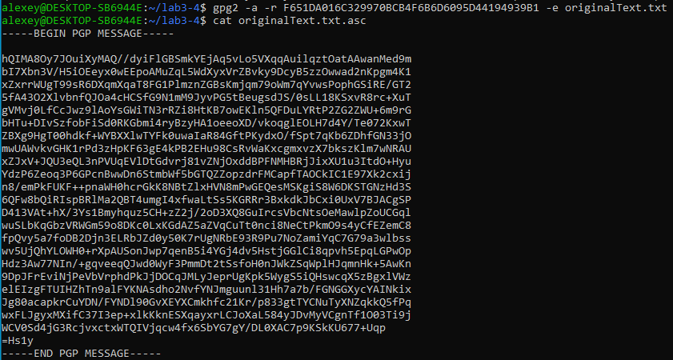
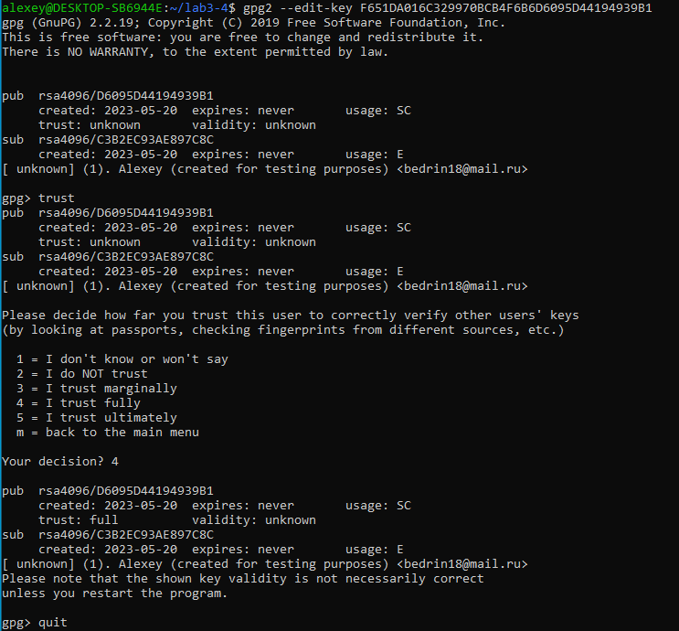
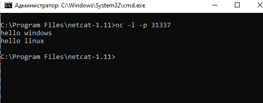
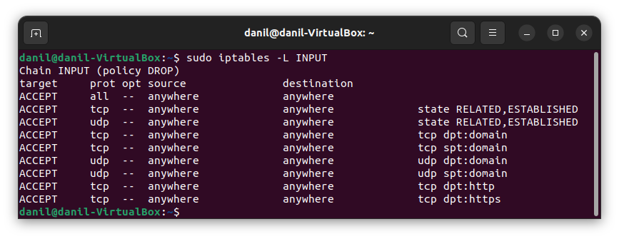

# 1. Network application

**Цель работы:** Освоение набора системных вызовов для создания 
socket-соединений различных типов для обмена данными на хостах и по сети.

*См. отчет по предмету "Операционные системы*

# 2. L4 Socket sample

**Цель работы:** Создание клиент-серверных приложений, взаимодействующих 
друг с другом по сети на основе технологии соединения на сокетах L4.

*См. отчет по предмету "Операционные системы*

# 3. GnuPG tool utilisation 1

## 1. Цель работы 

Установка утилиты GnuPG, исследование ее режимов работы с различными опциями и ключами и выполнение команд из базового списка.

## 2. Ход работы

Данная работа выполнялась на ОС Ubuntu 20.04.6 на WSL (Windows Subsystem for Linux).

## 3. Установка GNU PG2

Установим GNU PG2 (GPG2):

Выведем информацию о текущей версии GPG2:

## 4. Генерация ключей

Сгенерируем ключи для шифрования и подписи (тип 1), размером 4096 и бесконечным временем жизни:

Убедимся в том, что ключ действительно создан и распознан GPG2:

Действительно, сгенерированный ключ появился в списке. Выведем отпечаток ключа - в дальнейшем он потребуется для проверки корректности импорта ключа с сервера:

Проверим структуру папки .gnupg после генерации ключей. Для этого воспользуемся утилитой tree, которая строит файловую структуру заданной папки в удобном визуальном формате:

В полученной структуре можно заметить следующие объекты:

- Каталог, хранящий в себе открытые ключи (opengp-revocs.d);
- Каталог, хранящий в себе приватные ключи (private-keys-v1.d);
- Зашифрованный файл - связку открытых ключей (pubring.kbx);
- Файл с доверительной базой данных (trustdb.gpg).

## 5. Шифрация и дешифрация файла

Создадим документ с произвольным текстом для дальнейшей работы с ним:

Зашифруем созданный файл созданным ранее ключом:

Дешифруем полученный файл тем же ключом, сравним исходный и полученный файлы:

Различий между исходным файлом и результирующим файлом нет, что свидетельствует об успешном процессе шифрации и дешифрации.

## 6. Создание цифровой подписи

Создадим новый файл, сгенерируем к нему цифровую подпись:

Проверим полученную цифровую подпись:

Полученный результат "Good signature" свидетельствует о том, что подписанному документу был найден соответствующий ключ из хранилища.

## 7. Исследование прочих команд GPG2

При помощи GPG2 возможна и более тонкая настройка ключа при его создании при добавлении флага **--expert**. Попробуем создать ещё один ключ подобным образом:

Очевидно, что помимо добавления и создания ключей доступна операция их удаления из хранилища. Попроуем удалить созданные нами ключи в правильном порядке: сначала приватные, затем связанные с ними публичные:

## 8. Выводы

В рамках данной работы были изучены основы работы с GPG: создание и удаления пар ключей (публичный/приватный), шифрация и дешифрация файлов при помощи ключей, создание электронной подписи файла и её проверка.

# 4. GnuPG tool utilisation 2

## 1. Цель работы

Импорт и экспорт ключей (цифровых подписей), шифрование сообщений с помощью цифровых подписей.

## 2. Ход работы

Данная работа выполнялась на ОС Ubuntu 20.04.6 на WSL (Windows Subsystem for Linux).

## 3. Создание и использование электронной цифровой подписи (ЭЦП)

Шифрация файлов и проверка подписей может осуществляться при помощи открытого ключа. Для дальнейшей работы используется ключ, созданный в предыдущей лабораторной работе:

Экспортируем данный ключ в внешний файл:

Создадим новый файл для дальнейшей работы с ним:

Создадим для него отсоединённую ЭЦП в текстовом формате:

Аналогичным образом, создадим отсоединённую ЭЦП в бинарном формате:

После выполнения команды произошло создание файла ЭЦП originalText3.txt.sig, который и является отсоединённой ЭЦП.

Создадим встроенную в файл ЭЦП в текстовом формате:

Аналогичным образом, создадим встроенную ЭЦП в бинарном формате:

После выполнения команды произошло создание файла originalText3.txt.gpg.

## 4. Импорт и экспорт ключей

Предварительно отчистив хранилище ключей, импортируем созданный ранее ключ и убедимся в корректности его импорта:

Отредактируем импортированный ключ - установим к нему доверие, что потребуется для дальнейшей проверки ЭЦП:

Теперь, при наличии импортированного доверенного ключа, проверим отсоединённую ЭЦП из предыдущего пункта:

Полученный результат - Good signature - свидетельствует о том, что ключ соответствует использованному при генерации ЭЦП.

Экспортируем этот же ключ на внешний сервер keyserver.ubuntu.com, убедимся в том, что ключ действительно находится на сервере:

Первая полученная ошибка может быть объяснена тем, что сервер не успел так быстро обработать полученный ключ - поэтому первый запрос ключа закончился получением ошибки, а второй прошёл успешно.

Импортируем экспортированный ранее ключ:

Полученный с сервера ключ соответствует имеющемся, о чём говорит строка unchanged: 1 в результате.

## 5. Выводы

В рамках данной работы были изучены основные способы генерации встроенных и отсоединённых ЭЦП при помощи GPG2. Также был получен практический опыт по импорту и экспорту ключей как в отдельный файл, так и на внешний сервер.

# 5. WireShark packet sniffing

**Цель работы:** Установка и исследование возможностей анализатора 
сетевого трафика Wireshark.

*TODO*

# 6. Nmap network scanning

**Цель работы:** Исследование утилиты Nmap для сканирования сегмента сети.

*TODO*

# 7. Netcat and Cryptcat utilities

## 1. Цель работы

Исследование взаимодействия процессов на разных хостах с использованием утилит Netcat и её защищенного аналога Cryptcat.

## 2. Ход работы

Устройства, за которыми производилось исследование утилит, подключены с помощью Wi-Fi роутера к домашней сети. В таблице ниже преведены некоторые параметры устройств в этой сети.

| Тип               | IP адрес       |
| ----------------- | -------------- |
| Хост с OC Linux   | 192.168.31.239 |
| Хост с ОС Windows | 192.168.31.26  |

## 3. Утилита Netcat

**Netcat** — это сетевой инструмент для чтения и записи данных через сетевые подключения с использованием TCP или UDP.

### 3.1. Netcat чат

Организуем простой чат с использованием утилиты Netcat. Для этого запустим на двух  хостах два экземпляра Netcat, один из которых будет находиться в состоянии слушателя, а второй инициировать подключение с первым. Подключение будет производиться по порту 31337.

**Флаги:**

- `-l` — прослушивать входящие соединения, а не инициировать подключение к удаленному хосту.

- `-p port` — устанаваливает порт прослушивания (в нашем случае 31337).

В результате на хосте с ОС Windows был запущен слушатель, к которому в последствии подключился хост с ОС Linux. На изображениях выше также продемонстрирован обмен сообщениями между двумя хостами.

### 3.2. Netcat передача файлов

Организуем передачу файлов с использованием утилиты Netcat. Попробуем передать текстовый файл с одного хоста на другой. Содержимое файла представлено на рисунке ниже.

Для передачи файла запустим утилиту Netcat в режиме слушателя по порту 31337 на одном хосте и зададим передаваемый файл, после чего инициируем соединение с другого хоста для получения передаваемого файла. 

**Флаги:**

- `-v` — подробный режим отображения логов.

- `-l` — прослушивать входящие соединения, а не инициировать подключение к удаленному хосту.

- `-w timeout` — автоматически закрыть соединение, если соединение и stdin простаивают более *timeout* секунд.

- `-n` — не выполнять поиск имен через DNS

При попытке инициирования подключения у клиента появляется сообщение о том, что данный порт отркты для этого ip адреса. На стороне слушателя появилось сообщение о подключении клиента (по ip адресу видно, что подключился наш хост с ОС Linux). Спустя 30 секунд бездействия произошло автоматическое закрытие соединения. В результате файл был успешно передан.

## 4. Утилита Cryptcat

**Cryptcat**— это стандартный netcat, дополненный шифрованием twofish (симметричный алгоритм блочного шифрования с размером блока 128 бит и длиной ключа до 256 бит).

Попробуем организовать чат с использованием утилиты cryptcat, а также проанализируем трафик с помощью сетевого снифера Wireshark в случае защищенного и открытого соединений.

Принцип организации соединения остался таким же. Единственным отличием является наличие симметричного ключа.

**Флаги:**

- `-k keyword` — назначение симметричного ключа.

Воспользуемся сетевым снифером Wireshark и сравним трафик в случае защищенного/открытого соединения. В результате видим, что пакеты переданные с помощью утилиты netcat в заголовке data содержат сообщения в открытом виде, что показано на рисунке ниже.

Cryptcat в свою очередь шифрует всю передаваемую информацию. На рисунке ниже показан пример зашифрованных данных в заголовке data.

## 5. Вывод

В данной работе мы познакомились с возможностями утилиты netcat и её безопасной версии cryptcat.

# 8. Firewalls, iptables rules

## 1. Цель работы

Исследование контроля и фильтрации проходящего сетевого трафика в соответствии с заданными правилами с использованием утилиты iptables.

## 2. Ход работы

**iptables** — утилита командной строки, является стандартным интерфейсом управления работой межсетевого экрана netfilter для ядер Linux. Iptables оперирует некими правилами (rules), на основании которых решается судьба пакета, который поступил на интерфейс сетевого устройства.

### 2.1. Получение списка правил

Посмотреть текущие правила, установленные в iptables, можно при помощи команды:
`sudo iptables -L`.
Результат её работы представлен на рисунке ниже.

### 2.2. Блокировка всего входящего трафика

Заблокируем весь входящий трафик. Для этого воспользуемся командой: 
`sudo iptables -A INPUT -j DROP`

**Флаги:**

+ `-A chain rule-specificationУ `— добавить одно или несколько правил в конец выбранной цепочки.

+ `-j target `— определить цель правила (что делать, если пакет соответствует правилу)

На рисунке ниже представлено сосояние списка после добавления нового правила.

Вызова утилиты ping и использование браузера не дали результата. Число заблокированных пакетов можно увидеть на рисунке ниже.

### 2.3. Фильтрация входящего трафика

Попробуем отфильтровать весь трафик так, чтобы проходил только веб-трафик. Для этого:

1. Установим **DROP** в качестве политики по умолчанию

    `sudo iptables -P INPUT DROP`

2. Разрешим трафик для loopback, чтобы внутренние сервисы нормально работали

    `sudo iptables -A INPUT -i lo -j ACCEPT`

3. Теперь разрешим TCP и UDP соединения, которые сами создаем:

    `sudo iptables -A INPUT -p tcp -m state --state ESTABLISHED,RELATED -j ACCEPT`

    `sudo iptables -A INPUT -p udp -m state --state ESTABLISHED,RELATED -j ACCEPT`

4. Разрешим работу DNS-сервиса

    `sudo iptables -A INPUT -p tcp --dport 53 -j ACCEPT`

    `sudo iptables -A INPUT -p tcp --sport 53 -j ACCEPT`

    `sudo iptables -A INPUT -p udp --dport 53 -j ACCEPT`

    `sudo iptables -A INPUT -p udp --sport 53 -j ACCEPT`

5. Разрешим http и https

    `sudo iptables -A INPUT -p tcp --dport 80 -j ACCEPT`

    `sudo iptables -A INPUT -p tcp --dport 443 -j ACCEPT`

**Флаги:**

+ `-A chain rule-specification` — добавить одно или несколько правил в конец выбранной цепочки.

+ `-P chain target `— устанавливает политику для цепочки на заданную цель

+ `-i name` — определяет имя интерфейса, через который был получен пакет

+ `-j target` — определить цель правила (что делать, если пакет соответствует правилу)

+ `-p protocol` — определяет протокол правила или пакета для проверки

+ `--state state` — определяет состояния соединения, которым нужно соответствовать
  
  + **ESTABLISHED** — пакет связан с соединением, которое просматривало пакеты в обоих направлениях
  
  + **RELATED** — пакет запускает новое соединение, но связан с существующим соединением

+ `--dport [ports]` — порт назначения является одним из заданных портов

+ `--sport [ports]` — порт источника является одним из заданных портов

Итоговая таблица правил представлена на рисунке ниже

Проверим работу нашего фильтра. Для эмуляции работы WEB-сервера используем Netcat.

В результате видим, что передача произошла без потерь.

## 3. Вывод

В  ходе выполнения данной работы нами были изученые основные возможности управления цепочками правил при помощи утилиты iptables.

По итогам работы нами был разработан сервер защищённый от внешних подключений.

# 9. Iptables implementation

**Цель работы:** Установка правил фильтрации исходящего трафика при помощи утилиты iptables.

*TODO*

# 10. Connections Limit

**Цель работы:** Ограничение количества ssh-соединений.

*TODO*

# 11. L2, L3 Sockets sniffing

**Цель работы:** Исследование возможности RAW-сокетов предоставляющих доступ к полям заголовков 
сообщений протоколов уровней L2 и L3 модели OSI.

*TODO*
